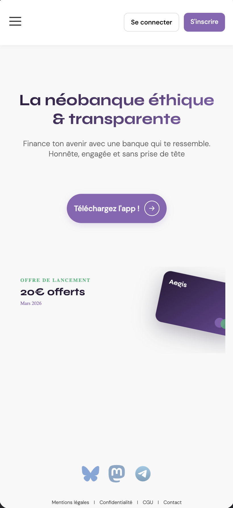

# Aegis Bank - Landing Page Mobile-First

Néobanque éthique et transparente dédiée aux créateurs de contenu, streamers et artistes digitaux.

## Contexte du projet

Landing page développée dans le cadre d'une mission fictive pour **Namcod**, simulant les conditions réelles du monde professionnel. L'objectif est de créer une interface mobile-first **sans scroll** pour la section dédiée aux créateurs de contenu d'Aegis Bank.

## Objectifs

- Positionner Aegis Bank comme alternative éthique aux néobanques traditionnelles
- Offrir une expérience zero-scroll optimisée pour mobile
- Cibler les 18-25 ans (créateurs de contenu, streamers, artistes digitaux)
- Mettre en avant la transparence, le respect de la vie privée et l'éthique

## Technologies utilisées

- **HTML5** sémantique (header, main, section, nav, footer)
- **CSS3** avec Variables CSS (Design System)
- **Méthodologie BEM** pour l'architecture CSS
- **Mobile-First** responsive design
- **Flexbox** pour la mise en page
- **Animations CSS** pour l'interactivité

## Fonctionnalités

- **Hero section** avec titre dégradé animé
- **CTA principal** "Téléchargez l'app !" avec effets hover
- **Card promotionnelle** "20€ offerts - Mars 2026"
- **Social links** (Bluesky, Mastodon, Telegram) avec animations
- **Navigation** avec burger menu et boutons d'authentification
- **Footer** avec liens légaux

## 🎨 Design System

Variables CSS implémentées pour :
- **Couleurs** : Palette mauve (#8A65B5) cohérente
- **Typographie** : Arial/Helvetica pour lisibilité optimale
- **Animations** : Effets hover subtils et professionnels

## 📸 Aperçu




## Voir le site en ligne

https://6978dcf2acc2cf006ebb6bd2--majestic-griffin-737815.netlify.app

## 📂 Structure du projet
```
aegis-bank/
├── index.html          # Page principale
├── style.css           # Feuille de styles avec variables CSS
├── images/             # Logos réseaux sociaux (SVG)
│   ├── bluesky-logo.svg
│   ├── mastodon-logo.svg
│   └── telegram-logo.svg
└── README.md
```

## Auteur

**Marielle Limbourg** - Étudiante UX/UI Design en alternance à l'EFP (Bruxelles)

Projet réalisé dans le cadre de la formation de conception web.

## Notes

Ce projet est un exercice pédagogique. Aegis Bank, Namcod et Remolut sont des entreprises fictives créées pour simuler un environnement professionnel réel.